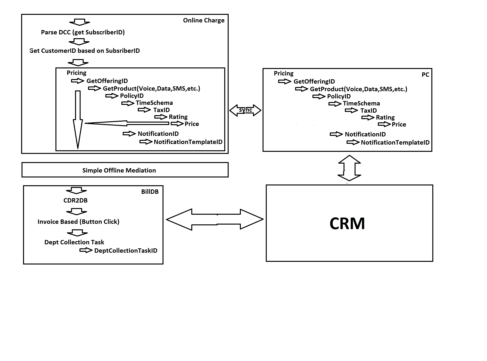

# ISP_Online-Charging-System_DCC
Author: Fariz Muradov

## Online Charging System with DCC protocol suite developed as prototype
Database architecture

### STRAT LOCAL DATABASE (currently SQLite3)
<pre>
> cd DBSERVER/src/
> python DBServer.py
Server started with 0.0.0.0 | 9999
<sqlite3.Connection object at 0x7fafa6a55770>
waiting for connection... listening on port 9999
...connected from: ('xx.xx.xx.xx', 35274)
waiting for connection... listening on port 9999
</pre>

### Start DIAMETER server
<pre>
> cd CHARGEPOINT/src
> python f_demo_OCS_Server.py
</pre>

NOTE: This code must still be changed to receive data via the DCC interface. 

